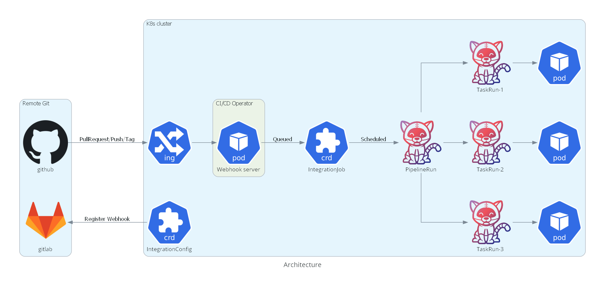

# CI/CD Operator Documents

## Overall Architecture

## Contents
- [Installation Guide](./installation.md)
- [Configuring Operator](./configs.md)
- [Configuring Blocker](./config_blocker.md)
- [Configuring Templates](./config_templates.md)
- [Quick Start Guide](./quickstart.md)
- [Configuring IntegrationConfig](./integration_config.md)
- [Add Approval step](./approval.md)
- [Add Notification steps](./notification-jobs.md)
- [Chat Commands](./chat-commands.md)
